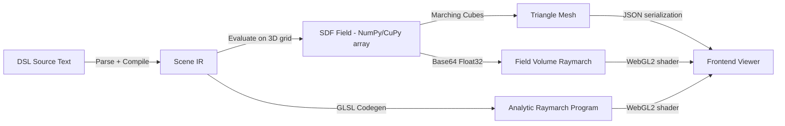
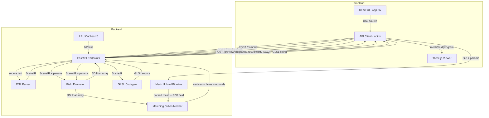

# SDF CAD — Codebase Architecture & Performance Improvement Plan

## 1. Architecture Overview

### 1.1 What Is SDF CAD?

SDF CAD is a **browser-based CAD tool** that uses **Signed Distance Functions** to define and render 3D geometry. Users write shapes in a custom DSL, the backend evaluates them on a 3D grid, and the frontend renders the result via Three.js — either as a triangle mesh or as a GPU-raymarched volume.

### 1.2 High-Level Pipeline



### 1.3 Module Map

| Module | File | Lines | Role |
|--------|------|-------|------|
| **DSL Parser** | [`dsl.py`](backend/app/dsl.py) | 901 | Lark LALR grammar → AST → Scene IR |
| **Models** | [`models.py`](backend/app/models.py) | 273 | Pydantic request/response types, Scene IR schema |
| **Evaluator** | [`evaluator.py`](backend/app/evaluator.py) | 1347 | Recursive scene graph evaluation on NumPy/CuPy grids |
| **Meshing** | [`meshing.py`](backend/app/meshing.py) | 722 | CPU marching cubes via skimage, CUDA marching cubes via CuPy RawKernel |
| **Cache** | [`cache.py`](backend/app/cache.py) | 179 | LRU caches for compile, field, mesh, and upload results |
| **GPU Program** | [`gpu_program.py`](backend/app/gpu_program.py) | 634 | Scene IR → GLSL SDF function for WebGL2 analytic raymarch |
| **Mesh Upload** | [`mesh_upload.py`](backend/app/mesh_upload.py) | 727 | STL/OBJ parsing, voxelization, EDT-based SDF, hollow shell + lattice fill |
| **API Layer** | [`main.py`](backend/app/main.py) | 1166 | FastAPI REST + WebSocket endpoints |
| **Frontend App** | [`App.tsx`](frontend/src/App.tsx) | 1047 | React UI with DSL editor and mesh workflow modes |
| **API Client** | [`api.ts`](frontend/src/lib/api.ts) | 437 | REST/WebSocket client functions |
| **3D Viewer** | [`Viewer.tsx`](frontend/src/components/Viewer.tsx) | 971 | Three.js renderer with mesh, field-volume, and analytic raymarch modes |
| **Types** | [`types.ts`](frontend/src/types.ts) | 142 | TypeScript type definitions mirroring backend models |

### 1.4 Data Flow Detail



### 1.5 Key Abstractions

- **SceneIR**: A graph of [`SceneNode`](backend/app/models.py:35) objects. Each node has a `type` — primitive, boolean, transform, field_expr, domain_op, lattice, turbomachine — with `inputs` referencing child node IDs and a `params` dict.
- **`_FieldRuntime`** in [`evaluator.py`](backend/app/evaluator.py:135): Recursively walks the scene graph, evaluating each node's SDF on 3D coordinate grids. Supports NumPy (CPU) and CuPy (CUDA) backends with automatic fallback.
- **Quality tiers**: interactive=64³, medium=128³, high=192³, ultra=256³ voxels for field evaluation. Mesh upload uses 48/72/96/128.
- **Three render modes**: Triangle mesh (default), Field volume raymarch (WebGL2 3D texture), Analytic raymarch (compiled GLSL SDF).

---

## 2. Performance Issues — Categorized by Severity

### 2.1 🔴 Critical — Large Impact on User Experience

#### P1: `.tolist()` Serialization of Large NumPy Arrays
- **Location**: [`main.py:359-361`](backend/app/main.py:359), [`main.py:602-604`](backend/app/main.py:602), [`main.py:1064-1066`](backend/app/main.py:1064)
- **Problem**: Converting NumPy arrays to nested Python lists via `.tolist()` is extremely slow for large meshes. A 200k-triangle mesh produces ~200k×3 index tuples + ~100k×3 vertex tuples — each element individually boxed as a Python float/int.
- **Impact**: Can add 200-500ms to mesh serialization at high quality.
- **Fix**: Use binary encoding — serialize vertices/faces/normals as base64-encoded Float32/Int32 buffers, similar to how field data is already sent as `f32-base64`. On the frontend, decode directly into `Float32Array`/`Uint32Array` typed arrays.

#### P2: JSON Array Mesh Transfer Protocol
- **Location**: [`main.py:383-384`](backend/app/main.py:383), [`api.ts:106-121`](frontend/src/lib/api.ts:106), [`types.ts:57-61`](frontend/src/types.ts:57)
- **Problem**: Mesh data `vertices: [number,number,number][]`, `indices`, `normals` sent as JSON arrays. For a 100k-vertex mesh, this is ~5MB of JSON text vs ~1.2MB of binary float32 data. JSON parsing on the frontend is also slow.
- **Impact**: 4-5× bandwidth overhead, 100-300ms extra parse time.
- **Fix**: Binary protocol — send mesh as `{meta: {...}, data: base64}` with a compact binary layout, or use MessagePack/CBOR. Frontend decodes directly to typed arrays.

#### P3: Duplicate Slow `_compute_vertex_normals` in main.py
- **Location**: [`main.py:137-155`](backend/app/main.py:137) vs [`meshing.py:334-350`](backend/app/meshing.py:334)
- **Problem**: `main.py` has its own `_compute_vertex_normals` using a Python `for` loop over every face. The version in `meshing.py` uses vectorized `np.add.at`. For a 200k-face mesh, the Python-loop version is ~100× slower.
- **Impact**: Adds 500ms+ for large uploaded meshes.
- **Fix**: Delete the duplicate in `main.py` and import the vectorized version from `meshing.py`. Or use the vectorized pattern: compute face normals via cross products, then scatter-add with `np.add.at`.

#### P4: STL Binary Parsing via Python Loop
- **Location**: [`mesh_upload.py:394-415`](backend/app/mesh_upload.py:394)
- **Problem**: `_parse_stl_binary` uses a Python `for` loop with `struct.unpack_from` for every triangle. For a 500k-triangle STL file, this takes several seconds.
- **Impact**: 2-5 seconds for large STL files.
- **Fix**: Use `np.frombuffer` with a structured dtype to read all triangles in one vectorized operation:
  ```python
  dt = np.dtype([('normal', '<3f4'), ('v0', '<3f4'), ('v1', '<3f4'), ('v2', '<3f4'), ('attr', '<u2')])
  data = np.frombuffer(buffer, dtype=dt, count=tri_count, offset=84)
  ```

#### P5: `circular_array` Brute-Force Loop
- **Location**: [`evaluator.py:988-1019`](backend/app/evaluator.py:988)
- **Problem**: For `circular_array(child, count=N)`, evaluates the child SDF N times, each time creating rotated coordinate arrays. For `count=24` at resolution 192³, this means 24 × 7M-point evaluations.
- **Impact**: O(count × grid_size) — can dominate evaluation time for impeller/turbine scenes.
- **Fix**: Exploit rotational symmetry — fold the angular domain into one period using `atan2`, evaluate child once, then take minimum. For simple primitives, this reduces from O(N) to O(1) child evaluations.

### 2.2 🟡 Medium — Noticeable Under Load

#### P6: `LruCache` O(n) List Removal
- **Location**: [`cache.py:23-43`](backend/app/cache.py:23)
- **Problem**: `self._order.remove(key)` performs a linear scan on every cache `get()` and `set()`. With 64 entries max this is currently tolerable, but it's architecturally wrong.
- **Impact**: Microseconds currently; would become problematic with larger cache sizes.
- **Fix**: Replace with `collections.OrderedDict` which provides O(1) `move_to_end()` and O(1) `popitem(last=False)`.

#### P7: Cache Hash Serializes Full Scene IR Every Time
- **Location**: [`cache.py:96-115`](backend/app/cache.py:96)
- **Problem**: `hash_preview_request` calls `scene_ir.model_dump(mode="json")` and `json.dumps(...)` for every hash computation. For complex scenes with many nodes, this serialization can take 1-5ms per call.
- **Impact**: Called on every preview request — adds cumulative overhead.
- **Fix**: Pre-compute `source_hash` during compilation and use it as part of the cache key instead of re-serializing the entire IR.

#### P8: Synchronous Blocking Handlers
- **Location**: [`main.py:641`](backend/app/main.py:641), [`main.py:658`](backend/app/main.py:658), [`main.py:724`](backend/app/main.py:724)
- **Problem**: `preview_mesh`, `preview_field`, and `export_mesh` are synchronous `def` handlers. FastAPI runs these in a threadpool, but they block the limited pool threads during heavy computation (seconds for high-quality evaluation).
- **Impact**: Under concurrent requests, the threadpool can become exhausted, causing request queuing.
- **Fix**: Either use `async def` with explicit `await asyncio.to_thread(...)` for compute-heavy work (as already done for WebSocket handlers), or increase the threadpool size. The WebSocket handlers already follow the correct pattern.

#### P9: CUDA Marching Cubes — No Vertex Deduplication
- **Location**: [`meshing.py:380-457`](backend/app/meshing.py:380)
- **Problem**: The CUDA marching cubes kernel generates unique vertices per triangle (no shared vertices). This results in 3× more vertices than necessary, increasing memory, serialization, and rendering cost.
- **Impact**: 3× vertex data size; redundant GPU memory on frontend.
- **Fix**: Add a post-processing vertex welding pass — either on CPU using spatial hashing, or a GPU-based dedup using CuPy sort+unique on quantized vertex positions.

#### P10: `strut_lattice` Segment Loop Without Numba
- **Location**: [`evaluator.py:1049-1064`](backend/app/evaluator.py:1049)
- **Problem**: Iterates over all lattice strut segments in a Python `for` loop, computing distance to each segment per grid point. No Numba or vectorized batching.
- **Impact**: Slow for dense strut lattices with many segments.
- **Fix**: Vectorize the segment distance computation using broadcasting, or add a `@njit(parallel=True)` Numba kernel similar to the existing `_blade_field_numba`.

#### P11: `mesh_to_stl` Python For-Loop
- **Location**: [`meshing.py:687-722`](backend/app/meshing.py:687)
- **Problem**: Builds STL binary records with a Python `for` loop over every face, using `struct.pack` per triangle.
- **Impact**: Several seconds for large meshes (200k+ faces).
- **Fix**: Use `np.ndarray.tobytes()` with a structured dtype to pack all triangles at once:
  ```python
  dt = np.dtype([('normal', '<3f4'), ('v0', '<3f4'), ('v1', '<3f4'), ('v2', '<3f4'), ('attr', '<u2')])
  records = np.zeros(num_faces, dtype=dt)
  # fill vectorized
  return header + records.tobytes()
  ```

#### P12: `mesh_to_obj` Python For-Loop
- **Location**: [`meshing.py:674-683`](backend/app/meshing.py:674)
- **Problem**: Builds OBJ text with a Python `for` loop. For 100k vertices, string concatenation is slow.
- **Impact**: 500ms-1s for large meshes.
- **Fix**: Use `np.savetxt` to a `StringIO` buffer, or format all vertex/face lines using vectorized string operations.

#### P13: Export Endpoint Re-serializes Data
- **Location**: [`main.py:740-744`](backend/app/main.py:740), [`main.py:888-892`](backend/app/main.py:888)
- **Problem**: The export endpoint first generates a preview (which converts NumPy → Python lists for JSON), then converts lists back to NumPy arrays for STL/OBJ writing. Double conversion wastes time.
- **Impact**: ~200ms wasted for round-trip conversion.
- **Fix**: Add an internal code path that returns `MeshData` (NumPy arrays) directly without the `.tolist()` conversion, and use that for export. Cache `MeshData` objects instead of or alongside the list-based cache entries.

#### P14: `_triangles_to_indexed_mesh` Python Dict Dedup
- **Location**: [`mesh_upload.py:451-476`](backend/app/mesh_upload.py:451)
- **Problem**: Vertex deduplication using a Python dict with quantized tuple keys. For large triangle soups, dict operations per-vertex are slow.
- **Impact**: 500ms+ for meshes with 100k+ triangles.
- **Fix**: Use `np.unique` with `axis=0` on rounded vertex positions, or lexicographic sorting + unique detection.

#### P15: `validate_triangle_mesh` Edge Counting Python Loop
- **Location**: [`mesh_upload.py:82-97`](backend/app/mesh_upload.py:82)
- **Problem**: Python `for` loop over all faces to build an edge count dictionary.
- **Impact**: 100-500ms for large meshes.
- **Fix**: Vectorize edge extraction: create edge array from face indices, sort, and count using `np.unique` with `return_counts=True`.

### 2.3 🟢 Low — Good Practices / Minor Wins

#### P16: No Caching of Compiled GLSL Programs
- **Location**: [`gpu_program.py`](backend/app/gpu_program.py)
- **Problem**: GLSL compilation from Scene IR is not cached. Same scene recompiled on every `/preview/program` request.
- **Impact**: ~5-20ms per compilation — minor but avoidable.
- **Fix**: Add a cache keyed on `(source_hash, quality_profile, grid_bounds)`.

#### P17: Frontend Sequential API Calls
- **Location**: [`App.tsx:254-400`](frontend/src/App.tsx:254)
- **Problem**: `runDslPreview` calls `previewField` then `previewMesh` sequentially. Field result is displayed, then replaced by mesh result. But they could overlap partially.
- **Impact**: User waits for field+mesh total time instead of seeing field immediately while mesh computes.
- **Fix**: Fire field and mesh requests in parallel; display field result immediately, then swap to mesh when it arrives. Current code already does this logically — just ensure the field display is not cleared until mesh arrives.

#### P18: No Debouncing on Parameter Slider Changes
- **Location**: [`App.tsx:726-744`](frontend/src/App.tsx:726)
- **Problem**: Every slider `onChange` triggers a React state update. If the user subsequently clicks "Generate Shape", it uses the latest params. But if auto-preview were added in the future, lack of debouncing would flood the backend.
- **Impact**: Currently minimal since preview requires explicit button click; future-proofing concern.
- **Fix**: Add a debounced callback (e.g., `useDeferredValue` or `lodash.debounce`) if auto-preview is ever enabled.

#### P19: Frontend `packVec3` / `packIndices` Conversion
- **Location**: [`Viewer.tsx:482-508`](frontend/src/components/Viewer.tsx:482)
- **Problem**: `packVec3` and `packIndices` iterate over JSON arrays to fill typed arrays. If binary transfer were adopted (P1/P2), these functions would become unnecessary — data arrives pre-packed.
- **Impact**: ~20-50ms for large meshes; eliminated by fixing P1/P2.

#### P20: `decodeFloat32Base64` Byte-by-Byte Loop
- **Location**: [`Viewer.tsx:533-542`](frontend/src/components/Viewer.tsx:533)
- **Problem**: `atob()` + byte-by-byte loop to convert base64 string to `Float32Array`. Modern browsers have `fetch(data:...)` or `Uint8Array.from` approaches that are faster.
- **Impact**: ~10-30ms for 256³ fields.
- **Fix**: Use the `fetch` API to decode base64 more efficiently, or use a Web Worker for decoding.

#### P21: Chunked Evaluation Threshold
- **Location**: [`evaluator.py:1275-1291`](backend/app/evaluator.py:1275)
- **Problem**: Chunking only activates at resolution > 160. The chunk size of 72 slices is hardcoded. Not adaptive to available memory.
- **Impact**: Minor — works well enough for current quality tiers.
- **Fix**: Consider adaptive chunk sizing based on available RAM/VRAM, or lower the threshold.

---

## 3. Priority-Ordered Improvement Roadmap

Below is the recommended order based on **impact × feasibility**:

| Priority | ID | Issue | Impact | Effort |
|----------|----|-------|--------|--------|
| 1 | P3 | Duplicate slow `_compute_vertex_normals` | 🔴 Critical | Trivial — delete + import |
| 2 | P4 | STL binary parsing Python loop | 🔴 Critical | Low — numpy structured dtype |
| 3 | P1+P2 | Binary mesh transfer protocol | 🔴 Critical | Medium — backend + frontend changes |
| 4 | P11 | `mesh_to_stl` Python loop | 🟡 Medium | Low — numpy structured dtype |
| 5 | P6 | LruCache O(n) removal | 🟡 Medium | Trivial — use OrderedDict |
| 6 | P5 | `circular_array` brute force | 🔴 Critical | Medium — angular folding math |
| 7 | P13 | Export re-serialization | 🟡 Medium | Low — internal MeshData path |
| 8 | P14+P15 | Mesh upload Python loops | 🟡 Medium | Low — numpy vectorization |
| 9 | P8 | Synchronous blocking handlers | 🟡 Medium | Low — add async wrappers |
| 10 | P10 | `strut_lattice` without Numba | 🟡 Medium | Medium — Numba kernel |
| 11 | P12 | `mesh_to_obj` Python loop | 🟡 Medium | Low — vectorized string ops |
| 12 | P9 | CUDA MC vertex dedup | 🟡 Medium | Medium — GPU/CPU welding pass |
| 13 | P7 | Cache hash full scene serialization | 🟡 Medium | Low — use source_hash |
| 14 | P16 | Cache GLSL programs | 🟢 Low | Trivial — add cache dict |
| 15 | P17 | Frontend parallel API calls | 🟢 Low | Low — Promise.all |
| 16 | P20 | Base64 decode optimization | 🟢 Low | Trivial — modern API |

---

## 4. Detailed Fix Specifications

### Fix F1: Binary Mesh Transfer (P1 + P2)

**Backend changes** in [`main.py`](backend/app/main.py):
```python
def _encode_mesh_binary(mesh: MeshData) -> dict:
    verts_b64 = base64.b64encode(mesh.vertices.astype(np.float32).tobytes()).decode('ascii')
    faces_b64 = base64.b64encode(mesh.faces.astype(np.uint32).tobytes()).decode('ascii')
    norms_b64 = base64.b64encode(mesh.normals.astype(np.float32).tobytes()).decode('ascii')
    return {
        'encoding': 'binary-base64',
        'vertex_count': mesh.vertices.shape[0],
        'face_count': mesh.faces.shape[0],
        'vertices': verts_b64,
        'indices': faces_b64,
        'normals': norms_b64,
    }
```

**Frontend changes** in [`Viewer.tsx`](frontend/src/components/Viewer.tsx):
- Update `toGeometry` to accept binary-encoded payload and decode directly to `Float32Array`.

### Fix F2: Replace `_compute_vertex_normals` (P3)

In [`main.py`](backend/app/main.py:137):
- Delete lines 137-155
- Import from meshing: `from .meshing import compute_vertex_normals`
- Or inline the vectorized version using `np.add.at`

### Fix F3: Vectorized STL Parsing (P4)

In [`mesh_upload.py`](backend/app/mesh_upload.py:394):
```python
def _parse_stl_binary(data: bytes) -> np.ndarray:
    tri_count = struct.unpack_from('<I', data, 80)[0]
    dt = np.dtype([
        ('normal', '<3f4'), ('v0', '<3f4'), ('v1', '<3f4'),
        ('v2', '<3f4'), ('attr', '<u2')
    ])
    records = np.frombuffer(data, dtype=dt, count=tri_count, offset=84)
    triangles = np.stack([records['v0'], records['v1'], records['v2']], axis=1)
    return triangles
```

### Fix F4: OrderedDict-based LRU Cache (P6)

In [`cache.py`](backend/app/cache.py:23):
```python
from collections import OrderedDict

class LruCache(Generic[T]):
    def __init__(self, maxsize: int = 64):
        self._data: OrderedDict[str, T] = OrderedDict()
        self._maxsize = maxsize

    def get(self, key: str) -> T | None:
        if key not in self._data:
            return None
        self._data.move_to_end(key)
        return self._data[key]

    def set(self, key: str, value: T) -> None:
        if key in self._data:
            self._data.move_to_end(key)
        self._data[key] = value
        while len(self._data) > self._maxsize:
            self._data.popitem(last=False)
```

---

## 5. Architecture Observations

### 5.1 Strengths
- **Clean separation**: DSL → IR → Evaluation → Meshing pipeline is well-factored
- **Multi-backend support**: NumPy/CuPy for evaluation, CPU/CUDA for meshing, with automatic fallback
- **Progressive rendering**: WebSocket handlers stream coarse-then-fine results
- **Analytic raymarch path**: GLSL codegen avoids grid evaluation entirely for supported scenes
- **Numba acceleration**: Key hot loops (smooth min, spline distance, blade field) have Numba kernels

### 5.2 Technical Debt
- **Duplicate code**: `_compute_vertex_normals` exists in both `main.py` and `meshing.py` with different implementations
- **Mixed sync/async**: Some endpoints are sync `def`, others are `async def` — inconsistent
- **Cache stores Python lists**: Mesh cache stores `.tolist()` results, forcing reconversion for export
- **No streaming for large exports**: Export endpoint buffers entire STL/OBJ in memory

### 5.3 Scalability Considerations
- **Single-process**: No worker pool or task queue — heavy computation blocks the API process
- **In-memory caches**: All caches are in-process `dict`-based — not shared across workers, lost on restart
- **No GPU memory management**: CuPy arrays may accumulate without explicit cleanup under sustained load
