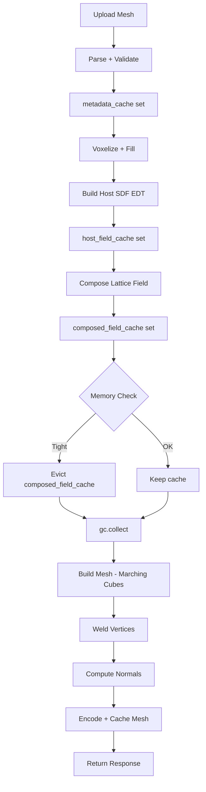

# Memory Audit & Optimisation Plan

## Problem Statement

After field computation completes, the system runs out of memory when attempting mesh generation. This is a **sequential memory exhaustion** problem: the field arrays remain in cache while meshing tries to allocate additional large arrays, causing OOM.

---

## Root Cause Analysis

### 1. Cache Sizes Are Too Large — Multiple Large Arrays Held Simultaneously

**File:** [`backend/app/cache.py`](../backend/app/cache.py)

```python
scene_compile_cache: LruCache[CompileCacheEntry] = LruCache(maxsize=64)   # 64 SceneIR objects
mesh_preview_cache: LruCache[MeshCacheEntry] = LruCache(maxsize=24)        # 24 full meshes
field_preview_cache: LruCache[tuple[np.ndarray, str]] = LruCache(maxsize=8) # 8 full field arrays
uploaded_mesh_preview_cache: LruCache[UploadedMeshCacheEntry] = LruCache(maxsize=12)
uploaded_mesh_metadata_cache: LruCache[UploadedMeshMetadataCacheEntry] = LruCache(maxsize=12)
uploaded_composed_field_cache: LruCache[UploadedComposedFieldCacheEntry] = LruCache(maxsize=12)
uploaded_host_field_cache: LruCache[UploadedHostFieldCacheEntry] = LruCache(maxsize=8)
```

**Problem:** At resolution 256, a single float32 field = 256³ × 4 bytes = **67 MB**. With `maxsize=8`, `field_preview_cache` can hold **536 MB** of field data. The `uploaded_composed_field_cache` with `maxsize=12` can hold **804 MB**. When meshing then needs to allocate its own arrays (vertices, faces, normals), the system OOMs.

**Fix:** Reduce all caches to `maxsize=1` since the user is working on one part at a time. The cache key already encodes all parameters, so a cache hit on the same request still works. When a new part or different parameters are requested, the old entry is evicted.

---

### 2. Memory Model Constants Are Inaccurate

**File:** [`backend/app/main.py:162-164`](../backend/app/main.py:162)

```python
MEMORY_MODEL_CPU_BYTES_PER_VOXEL = 32.0
MEMORY_MODEL_GPU_BYTES_PER_VOXEL = 40.0
MEMORY_MODEL_SAFETY_FACTOR = 1.25
```

**Problem:** The actual memory usage is much higher than 32 bytes/voxel:

| Stage | Arrays | Bytes/voxel |
|-------|--------|-------------|
| Field evaluation (CPU) | field (float32) + 3× meshgrid (float32) | 4 + 12 = **16 bytes** |
| Field evaluation (CUDA) | field (float32) + 3× GPU meshgrid | ~16 bytes GPU |
| Host SDF build | occupancy (bool) + surface (bool) + filled (bool) + dist_out (float64) + dist_in (float64) + host_sdf (float32) | 1+1+1+8+8+4 = **23 bytes** |
| Composed field | host_sdf (float32) + shell_field (float32) + out (float32) + mask (bool) | 4+4+4+1 = **13 bytes** |
| Meshing (CPU) | field (float32) + vertices (float64) + faces (int32) + normals (float64) | varies |
| Meshing (CUDA) | field (float32 GPU) + tri_counts (int32 GPU) + tri_offsets (int32 GPU) + vertices_flat (float32 GPU) + faces_flat (int32 GPU) | ~24 bytes GPU |
| **Cache overhead** | field_preview_cache + uploaded_composed_field_cache + uploaded_host_field_cache | **2-3× field size** |

The real peak is during meshing when the **cached field** + **meshing arrays** + **output mesh** all coexist. The warning path already compares against available memory directly, so the safety factor can stay at 1.0 for that check.

**Fix:**
- `MEMORY_MODEL_CPU_BYTES_PER_VOXEL` → `48.0` (field + host_sdf + composed + meshing intermediates)
- `MEMORY_MODEL_GPU_BYTES_PER_VOXEL` → `56.0`
- `MEMORY_MODEL_SAFETY_FACTOR` → `1.0`

---

### 3. Memory Spike: `_FieldRuntime.evaluate()` memo Dict

**File:** [`backend/app/evaluator.py:575`](../backend/app/evaluator.py:575)

```python
def evaluate(self, px: np.ndarray, py: np.ndarray, pz: np.ndarray) -> np.ndarray:
    memo: dict[tuple[str, int, int, int], np.ndarray] = {}
```

**Problem:** The `memo` dict uses `id(qx)` as part of the key. For chunked evaluation (resolution > 160), each chunk creates new arrays with new `id()` values, so the memo never hits and grows to hold all intermediate arrays from the current chunk. However, since `memo` is local to `evaluate()`, it is released after each call. This is **not a leak per se**; it is expected per-chunk peak memory. For complex scenes with many boolean operations, this can be 5-10× the field size.

**Fix:** The memo is already local and released after each chunk. No change needed here, but document this as expected behavior.

---

### 4. Memory Spike: `_cached_grid` and `_cached_axes` with maxsize=48

**File:** [`backend/app/evaluator.py:150-175`](../backend/app/evaluator.py:150)

```python
@lru_cache(maxsize=48)
def _cached_grid(bounds_key, resolution, dtype_name):
    ...  # returns 3 full meshgrid arrays of shape (res, res, res)

@lru_cache(maxsize=48)
def _cached_axes(bounds_key, resolution, dtype_name):
    ...  # returns 3 1D arrays of shape (res,)
```

**Problem:** `_cached_grid` at resolution 256 holds 3 × 256³ × 4 bytes = **201 MB** per cache entry. With `maxsize=48`, this could hold **9.6 GB** of grid data. In practice, only resolutions ≤ 160 use `_cached_grid`, but even at 160, 3 × 160³ × 4 = **49 MB** per entry × 48 = **2.3 GB**. This is bounded, but the bound is still far too high for a process that also needs to hold fields and meshes.

**Fix:** Reduce `_cached_grid` to `maxsize=2` and `_cached_axes` to `maxsize=4`. The axes are much smaller (3 × 256 × 4 = 3 KB) so a slightly larger cache is fine.

---

### 5. Memory Spike: `_weld_vertices` in Meshing

**File:** [`backend/app/meshing.py:358-377`](../backend/app/meshing.py:358)

```python
def _weld_vertices(vertices, faces, quant=1e-6):
    quantized = np.rint(vertices / quant).astype(np.int64)  # int64 = 2× float64 size
    _, unique_idx, inverse = np.unique(quantized, axis=0, ...)
```

**Problem:** `np.unique` on a large `int64` array creates multiple internal copies. For a mesh with 1M vertices, `quantized` = 1M × 3 × 8 = **24 MB**, and `np.unique` internally sorts and creates additional copies, peaking at ~3-4× the input size = **72-96 MB** spike.

**Fix:** After `np.unique`, explicitly `del quantized` before proceeding. Also consider using a hash-based approach instead of `np.unique` for large meshes.

---

### 6. CUDA Meshing Holds Multiple Large GPU Arrays Simultaneously

**File:** [`backend/app/meshing.py:407-485`](../backend/app/meshing.py:407)

```python
def _mesh_single_cuda(field, bounds):
    volume = cp.asarray(field, dtype=cp.float32)      # N³ × 4 bytes GPU
    tri_counts = cp.empty((cell_count,), dtype=cp.int32)  # (N-1)³ × 4 bytes GPU
    tri_offsets = cp.zeros((cell_count,), dtype=cp.int32)  # (N-1)³ × 4 bytes GPU
    vertices_flat = cp.empty((total_tris * 9,), dtype=cp.float32)  # up to 5× field size
    faces_flat = cp.empty((total_tris * 3,), dtype=cp.int32)
```

**Problem:** At peak, GPU holds: `volume` + `tri_counts` + `tri_offsets` + `vertices_flat` + `faces_flat`. For a dense mesh at resolution 256, `total_tris` can be ~2M triangles, so `vertices_flat` = 2M × 9 × 4 = **72 MB** and `faces_flat` = 2M × 3 × 4 = **24 MB**, plus the field itself = **67 MB**. Total GPU peak ≈ **200+ MB** just for meshing.

**Fix:** After `cp.asnumpy(vertices_flat)`, explicitly `del vertices_flat, faces_flat, tri_counts, tri_offsets, volume` and call `cp.get_default_memory_pool().free_all_blocks()` before the CPU-side welding step.

---

### 7. `_build_host_sdf_octree_sparse` Streams Block Results

**File:** [`backend/app/mesh_upload.py:904-980`](../backend/app/mesh_upload.py:904)

```python
def _apply_block_result(...):
    # applies one block immediately to host_sdf

for future in as_completed(futures):
    result = future.result()
    if result is not None:
        _apply_block_result(...)
```

**Problem:** The previous implementation accumulated all block distance arrays in `block_results` before applying them to `host_sdf`, which could hold hundreds of MB of intermediate float64 arrays simultaneously.

**Fix:** Apply each block result to `host_sdf` immediately as it completes. For the parallel case, process results as futures complete instead of buffering every block first.

---

### 8. `_voxelize_and_fill` Frees Boolean Arrays After Fill

**File:** [`backend/app/mesh_upload.py:1577-1633`](../backend/app/mesh_upload.py:1577)

```python
surface_u8 = _rasterize_surface_numba(...)  # uint8, N³ bytes
surface = surface_u8.astype(bool, copy=False)  # bool, N³ bytes (same memory if copy=False)
filled, fallback_reason = _dilate_close_and_fill(surface, ...)
# Inside _dilate_close_and_fill:
#   surface_gpu (GPU bool) + closing_structure + filled (CPU bool)
```

**Problem:** During `_dilate_close_and_fill`, the CPU path holds `surface` (bool) + `eroded` (bool) + `background` (bool) + `labels` (int32) + `fillable` (bool) simultaneously. At resolution 256: 256³ × (1+1+1+4+1) = **134 MB** just for the boolean operations.

**Fix:** Release `surface_u8` immediately after converting to `surface`, and release `surface` after the fallback checks that still need it. The cleanup is now implemented without changing the fill logic.

---

### 9. Pre-Meshing Cache Eviction

**File:** [`backend/app/main.py:1896-1910`](../backend/app/main.py:1896)

```python
# After field computation:
composed = _resolve_uploaded_composed_field(...)  # field is now in cache
# ...
generated, mesh_backend_used = build_mesh_with_backend(field, ...)  # OOM here
```

**Problem:** When meshing starts, the composed field is already cached in `uploaded_composed_field_cache`. The meshing function then needs to allocate vertices, faces, and normals arrays. With the field still in cache, there is less headroom for those allocations.

**Fix:** Before calling `build_mesh_with_backend`, check available CPU memory. If headroom is tight, clear `uploaded_composed_field_cache` and call `gc.collect()`. The live `field` variable still holds the composed field for the current request, so the cache entry is not needed during meshing.

---

### 10. Memory Warning Does Not Account for Cache Overhead

**File:** [`backend/app/main.py:1131-1141`](../backend/app/main.py:1131)

```python
required_cpu_bytes = int(np.ceil(voxel_count * context.cpu_bytes_per_voxel * context.safety_factor))
```

**Problem:** This calculation estimates memory for field computation only. It does not account for:
1. The field staying in cache while meshing runs
2. The host SDF also being in cache simultaneously
3. The meshing intermediate arrays (vertices_flat, faces_flat, normals)
4. The final mesh being encoded to base64 (another 1.5× copy)

The warning fires too late (or not at all) because the estimate is too optimistic.

**Fix:** The memory estimate should include:
- `field_bytes = voxel_count × 4` (float32 field)
- `host_sdf_bytes = voxel_count × 4` (float32 host SDF in cache)
- `meshing_bytes = voxel_count × 12` (estimated vertices + faces + normals, worst case)
- `encoding_bytes = voxel_count × 6` (base64 encoding overhead)
- Total: `voxel_count × 26 bytes` minimum, × safety factor

---

## Proposed Fixes — Detailed Implementation

### Fix A: Reduce Cache Sizes to maxsize=1

**File:** [`backend/app/cache.py`](../backend/app/cache.py)

```python
# Before:
scene_compile_cache: LruCache[CompileCacheEntry] = LruCache(maxsize=64)
mesh_preview_cache: LruCache[MeshCacheEntry] = LruCache(maxsize=24)
field_preview_cache: LruCache[tuple[np.ndarray, str]] = LruCache(maxsize=8)
uploaded_mesh_preview_cache: LruCache[UploadedMeshCacheEntry] = LruCache(maxsize=12)
uploaded_mesh_metadata_cache: LruCache[UploadedMeshMetadataCacheEntry] = LruCache(maxsize=12)
uploaded_composed_field_cache: LruCache[UploadedComposedFieldCacheEntry] = LruCache(maxsize=12)
uploaded_host_field_cache: LruCache[UploadedHostFieldCacheEntry] = LruCache(maxsize=8)

# After:
scene_compile_cache: LruCache[CompileCacheEntry] = LruCache(maxsize=8)   # text only, cheap
mesh_preview_cache: LruCache[MeshCacheEntry] = LruCache(maxsize=1)        # one mesh at a time
field_preview_cache: LruCache[tuple[np.ndarray, str]] = LruCache(maxsize=1) # one field at a time
uploaded_mesh_preview_cache: LruCache[UploadedMeshCacheEntry] = LruCache(maxsize=1)
uploaded_mesh_metadata_cache: LruCache[UploadedMeshMetadataCacheEntry] = LruCache(maxsize=4)  # cheap metadata
uploaded_composed_field_cache: LruCache[UploadedComposedFieldCacheEntry] = LruCache(maxsize=1)
uploaded_host_field_cache: LruCache[UploadedHostFieldCacheEntry] = LruCache(maxsize=1)
```

**Rationale:** The user works on one part at a time. The cache key encodes all parameters, so the same request still hits the cache. Different parameters evict the old entry. `uploaded_mesh_metadata_cache` can be slightly larger since it only holds vertices/faces arrays (cheap compared to SDF fields).

---

### Fix B: Reduce `_cached_grid` and `_cached_axes` Cache Sizes

**File:** [`backend/app/evaluator.py:150-175`](../backend/app/evaluator.py:150)

```python
# Before:
@lru_cache(maxsize=48)
def _cached_grid(...):

@lru_cache(maxsize=48)
def _cached_axes(...):

# After:
@lru_cache(maxsize=2)
def _cached_grid(...):  # Only used for resolution <= 160; 2 entries = coarse + fine

@lru_cache(maxsize=4)
def _cached_axes(...):  # 1D arrays, cheap; 4 entries for different bounds/resolutions
```

---

### Fix C: Fix Memory Model Constants

**File:** [`backend/app/main.py:162-164`](../backend/app/main.py:162)

```python
# Before:
MEMORY_MODEL_CPU_BYTES_PER_VOXEL = 32.0
MEMORY_MODEL_GPU_BYTES_PER_VOXEL = 40.0
MEMORY_MODEL_SAFETY_FACTOR = 1.0

# After:
# Breakdown:
#   field (float32): 4 bytes
#   host_sdf (float32, cached): 4 bytes
#   composed field (float32, cached): 4 bytes
#   voxelization intermediates (bool×3 + int32): ~7 bytes
#   meshing intermediates (vertices float64 + faces int32 + normals float64): ~20 bytes
#   encoding overhead (base64 ~1.33×): ~5 bytes
#   Total: ~44 bytes, round up to 48 with headroom
MEMORY_MODEL_CPU_BYTES_PER_VOXEL = 48.0
MEMORY_MODEL_GPU_BYTES_PER_VOXEL = 56.0  # GPU field + CPU field + meshing
MEMORY_MODEL_SAFETY_FACTOR = 1.0          # available-memory checks already gate the warning
```

---

### Fix D: Pre-Meshing Cache Eviction with Memory Pressure Check

**File:** [`backend/app/main.py`](../backend/app/main.py) — add a small helper that probes CPU memory, clears `uploaded_composed_field_cache`, and runs `gc.collect()` when headroom is tight.

```python
import gc

def _maybe_evict_uploaded_composed_field_cache_before_meshing(field: np.ndarray) -> bool:
    available_cpu = _available_cpu_memory_bytes()
    if available_cpu is None:
        return False
    field_bytes = int(field.nbytes)
    if available_cpu >= field_bytes * 4:
        return False

    uploaded_composed_field_cache.clear()
    gc.collect()
    return True
```

This helper is called immediately before `build_mesh_with_backend(...)` in the uploaded-mesh preview path and the uploaded-mesh websocket mesh phase.

---

### Fix E: Fix CUDA Meshing Memory Leak

**File:** [`backend/app/meshing.py:481-485`](../backend/app/meshing.py:481)

```python
# Before:
vertices = cp.asnumpy(vertices_flat).reshape(-1, 3).astype(np.float64, copy=False)
faces = cp.asnumpy(faces_flat).reshape(-1, 3).astype(np.int32, copy=False)
vertices, faces = _weld_vertices(vertices, faces)
normals = _compute_vertex_normals(vertices, faces)
return MeshData(vertices=vertices, faces=faces, normals=normals)

# After:
vertices_np = cp.asnumpy(vertices_flat).reshape(-1, 3).astype(np.float64, copy=False)
faces_np = cp.asnumpy(faces_flat).reshape(-1, 3).astype(np.int32, copy=False)
# Free GPU memory immediately after transfer
del vertices_flat, faces_flat, tri_counts, tri_offsets, volume
cp.get_default_memory_pool().free_all_blocks()
vertices, faces = _weld_vertices(vertices_np, faces_np)
del vertices_np, faces_np
normals = _compute_vertex_normals(vertices, faces)
return MeshData(vertices=vertices, faces=faces, normals=normals)
```

---

### Fix F: Fix `_weld_vertices` Memory Spike

**File:** [`backend/app/meshing.py:358-377`](../backend/app/meshing.py:358)

```python
def _weld_vertices(vertices, faces, quant=1e-6):
    if vertices.size == 0 or faces.size == 0:
        return vertices, faces

    quantized = np.rint(vertices / quant).astype(np.int64)
    _, unique_idx, inverse = np.unique(quantized, axis=0, return_index=True, return_inverse=True)
    del quantized  # Free immediately after np.unique
    welded_vertices = vertices[unique_idx]
    welded_faces = inverse[faces]
    del inverse, unique_idx  # Free after use

    valid_mask = (
        (welded_faces[:, 0] != welded_faces[:, 1])
        & (welded_faces[:, 1] != welded_faces[:, 2])
        & (welded_faces[:, 2] != welded_faces[:, 0])
    )
    welded_faces = welded_faces[valid_mask].astype(np.int32, copy=False)
    return welded_vertices, welded_faces
```

---

### Fix G: Stream `_build_host_sdf_octree_sparse` Block Results

**File:** [`backend/app/mesh_upload.py:916-980`](../backend/app/mesh_upload.py:916)

Instead of accumulating all block results and then applying them, apply each result immediately:

```python
# The implementation now applies each block result immediately as each worker
# finishes, so there is no large `block_results` list to retain.
```

---

### Fix H: Fix `_voxelize_and_fill` Intermediate Array Cleanup

**File:** [`backend/app/mesh_upload.py:1577-1633`](../backend/app/mesh_upload.py:1577)

```python
def _voxelize_and_fill(mesh, bounds, resolution):
    # ... rasterize ...
    surface_u8 = _rasterize_surface_numba(verts_grid, faces, resolution)
    del verts_grid, faces  # Free grid-space arrays
    surface = surface_u8.astype(bool, copy=False)
    del surface_u8  # Free uint8 array (bool shares memory if copy=False, but del the ref)
    
    filled, fallback_reason = _dilate_close_and_fill(surface, closing_iterations=1)
    del surface  # Free surface bool array after fill
    gc.collect()
    # ... rest of function ...
```

---

### Fix I: Add `gc.collect()` After Major Operations

**File:** [`backend/app/gpu_memory.py`](../backend/app/gpu_memory.py)

The existing `cleanup_runtime_memory()` already calls `gc.collect()`. Ensure it is called:
1. After field evaluation completes (before meshing)
2. After cache eviction
3. After CUDA-to-CPU transfers

---

## Memory Flow Diagram



---

## Memory Budget at Resolution 256

| Item | Size | Notes |
|------|------|-------|
| host_sdf (float32) | 67 MB | Cached in `uploaded_host_field_cache` |
| composed field (float32) | 67 MB | Cached in `uploaded_composed_field_cache` |
| field_preview_cache | 67 MB | Cached in `field_preview_cache` |
| Voxelization intermediates | ~100 MB | bool×3 + int32 labels |
| Meshing intermediates (CPU) | ~200 MB | vertices float64 + faces + normals |
| Mesh encoding | ~50 MB | base64 overhead |
| **Total peak (before fix)** | **~550 MB** | Plus OS + Python overhead |
| **Total peak (after fix)** | **~300 MB** | Evict caches before meshing |

---

## Implementation Priority

1. **Critical (fixes OOM):**
   - Fix A: Reduce cache sizes to maxsize=1
   - Fix D: Pre-meshing cache eviction
   - Fix C: Correct memory model constants

2. **High (reduces peak memory):**
   - Fix E: CUDA meshing GPU memory cleanup
   - Fix G: Streaming block results in octree sparse
   - Fix H: Voxelization intermediate cleanup

3. **Medium (prevents future issues):**
   - Fix B: Reduce `_cached_grid` cache size
   - Fix F: `_weld_vertices` memory spike

4. **Low (correctness/accuracy):**
   - Fix I: Ensure `gc.collect()` is called at right points

---

## Files to Modify

| File | Changes |
|------|---------|
| [`backend/app/cache.py`](../backend/app/cache.py) | Reduce all LRU cache maxsize values |
| [`backend/app/evaluator.py`](../backend/app/evaluator.py) | Reduce `_cached_grid` and `_cached_axes` maxsize |
| [`backend/app/main.py`](../backend/app/main.py) | Fix memory constants, add pre-meshing eviction |
| [`backend/app/meshing.py`](../backend/app/meshing.py) | Fix CUDA cleanup, fix `_weld_vertices` |
| [`backend/app/mesh_upload.py`](../backend/app/mesh_upload.py) | Fix block results streaming, fix voxelization cleanup |
| [`backend/app/gpu_memory.py`](../backend/app/gpu_memory.py) | Ensure `gc.collect()` is called appropriately |
